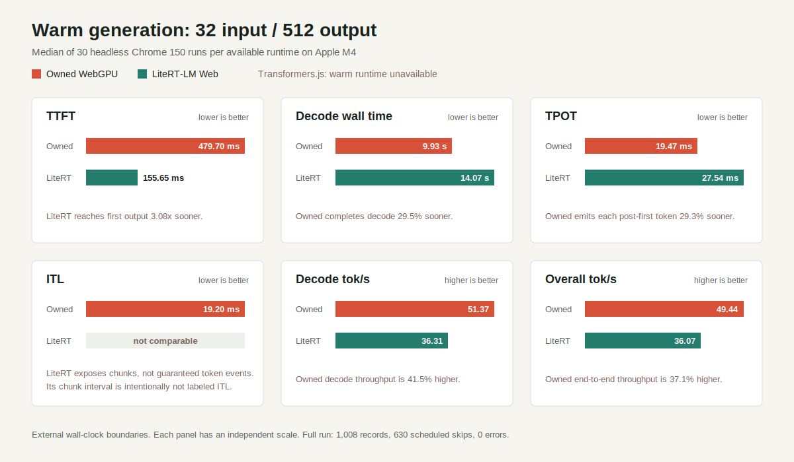

# Gemma WebGPU Engine

An inspectable WebGPU inference runtime for the Gemma 4 E2B QAT mobile backbone, built for low-latency browser generation and complete decoding control. It executes the mobile/QAT checkpoint through owned browser-native WebGPU kernels rather than a TFLite wrapper.

The engine optimizes the complete generation runtime, not a greedy-only benchmark path. Its full-logit execution supports seeded sampling, probability and penalty controls, tokenizer-aware constraints, streaming, cancellation, and profiling over the same owned transformer kernels. That is the key product distinction from the pinned [Hugging Face comparison runtime](https://huggingface.co/spaces/webml-community/gemma-4-webgpu-kernels) from Xenova, whose kernel throughput is slightly higher but public generation API is greedy-only. Kernel candidates are promoted only when they preserve this contract, retain exact deterministic output, and improve both median and p95 latency.

See [PROJECT.md](PROJECT.md) for architecture, correctness gates, model provenance, and the kernel roadmap.

## Start

```bash
npm install
npm run dev
```

Chrome with WebGPU is required for kernel benchmarks. Sampling tests do not require a GPU.
The first screen is the generation console. Because IndexedDB is origin-scoped, serve it from the
same scheme, host, and port that owns `safetensors-cache-v1`; the console inventories the origin and
keeps model loading disabled when that cache is absent. The Buza host exposes the permanent
same-origin route `http://localhost:8753/gemma-engine.html`. When this browser has no cached model,
that route enables **Initialize cache** and uses Buza's existing client-side downloader before
loading the owned engine; no inference backend is involved.

After loading, **Reload engine** performs a full user-forced WebGPU teardown and reconstruction from
the existing local file or IndexedDB cache; it never invokes the model downloader. Unexpected
device loss is handled automatically: the stale session is discarded, an in-flight request fails
without being committed, and a replacement session is built while committed conversation state is
retained. The status badges report queued recovery, reconstruction, success, or failure.

```bash
npm run typecheck
npm run test:unit
npm run test:gpu
npm run build
```

## Static Demo And Library

`npm run build` creates two minified, base-relative browser outputs:

- `build/index.html` is the complete generation console for static hosting.
- `build/library/gemma-webgpu-engine.min.js` is the public ES-module entry.

The build includes the tokenizer, validated runtime fixture, examples, icons, and separately
cacheable WebAssembly support. It deliberately excludes the 2.46 GB local checkpoint. On a new
origin, **Download model** range-fetches
[`google/gemma-4-E2B-it-qat-mobile-transformers`](https://huggingface.co/google/gemma-4-E2B-it-qat-mobile-transformers)
from `resolve/main/model.safetensors` directly into resumable IndexedDB storage, then loads the
Owned WebGPU engine from that cache. No model bytes pass through the static host.

To publish with GitHub Pages, deploy the contents of `build/` as the Pages artifact. All generated
URLs are relative, so both a user site and a repository path such as
`https://<account>.github.io/gemma-webgpu-engine/` work without a custom base setting. The build
also emits `.nojekyll`. GitHub Pages supplies the HTTPS secure context required by WebGPU and media
capture.

The library uses the same IndexedDB and lightweight `models/` support files as the console:

```js
import {
	initializeGemmaSafetensorsCache,
	loadGemmaGenerationSession,
} from "./library/gemma-webgpu-engine.min.js";

await initializeGemmaSafetensorsCache(
	(progress) => console.log(progress),
	{ localUrl: null },
);

const session = await loadGemmaGenerationSession({ cacheCapacity: 32_768 });
const result = await session.generate("Say hi in one short sentence.", {
	maxNewTokens: 16,
	temperature: 0,
});
console.log(result.text);
session.destroy();
```

The first download is approximately 2.46 GB and requires enough persistent browser storage. If the
Hugging Face repository requires acceptance or authentication for a visitor, static hosting cannot
hide a token; access must be granted upstream or supplied by a separate authenticated application.

## Generate

The owned runtime exposes a persistent generation session:

```ts
import { loadGemmaGenerationSession } from "./src/runtime/gemma-session";

const session = await loadGemmaGenerationSession({ cacheCapacity: 512 });
try {
	const controller = new AbortController();
	const result = await session.generate("Say hi in one short sentence.", {
		maxNewTokens: 16,
		temperature: 0.8,
		topK: 40,
		topP: 0.95,
		seed: 42,
		constraint: { type: "regex", pattern: "Hi!" },
		signal: controller.signal,
		onToken: ({ text }) => {
			console.log(text);
		},
	});
	console.log(result.text);
} finally {
	session.destroy();
}
```

For multi-turn chat, retain typed messages in the application and pass the complete history on
every request. Commit the pending user and assistant messages only after generation succeeds:

```ts
import type { GemmaChatMessage } from "./src/runtime/gemma-tokenizer";

let messages: GemmaChatMessage[] = [];

async function chat(content: string): Promise<string> {
	const pending: GemmaChatMessage[] = [...messages, { role: "user", content }];
	const result = await session.generate(pending, { maxNewTokens: 128 });
	if (!result.text.trim()) throw new Error("Gemma returned an empty response");
	messages = [...pending, { role: "assistant", content: result.text }];
	return result.text;
}
```

Editing an earlier user turn must discard assistant output and later turns that depended on the old
content. `prepareGemmaConversationEdit()` performs that truncation without mutating the retained
conversation. For multimodal history it keeps images owned by earlier turns and carries the edited
turn's image into the replacement request. After successful generation, commit the returned turn
against the returned truncated conversation. The session compares the newly serialized token IDs
with its evaluated IDs and retains only the exact common prefix; changed tokens therefore cannot
reuse stale K/V rows.

`encodeMessages()` applies the pinned July 9 canonical Gemma 4 template with
`add_generation_prompt: true`, mapping `assistant` to the template's `model` role and closing every
completed turn. Text requests reuse the longest matching K/V prefix by default, so resubmitting the
full history preserves correctness without forcing full prefill. Cancellation and failures must not
be appended to history. Start a new chat by replacing the message array; the next request detects
the changed prefix and resets the owned caches. A first `system` or `developer` message is supported.
The E2B and E4B model repositories currently publish the same canonical template, but this runtime
pins the E2B copy that belongs to its checkpoint.

The example picker includes `Boston weather · Tool call`, which supplies a typed function
declaration through the template's `tools` argument. Tool inputs use the structured form:

```ts
const result = await session.generate({
	messages: [{ role: "user", content: "Use get_current_weather for Boston." }],
	tools: [{
		type: "function",
		function: {
			name: "get_current_weather",
			description: "Get the current weather for a city.",
			parameters: {
				type: "object",
				properties: { location: { type: "string" } },
				required: ["location"],
			},
		},
	}],
}, { temperature: 1, topK: 64, topP: 0.95, seed: 42 });

console.log(result.toolCalls[0]?.function);
// { name: "get_current_weather", arguments: { location: "Boston, MA" } }
```

`result.text` remains clean display text. `result.rawText` retains canonical special-token blocks
for diagnostics, and `result.toolCalls` parses complete `<|tool_call>...<tool_call|>` blocks into
dispatchable function names and arguments. The console intentionally leaves a tool call
uncommitted until an application executes it and supplies a tool response.

Canonical Gemma 4 reasoning is a boolean structured-input capability and remains disabled by
default:

```ts
const result = await session.generate({
	messages: [{ role: "user", content: "Solve this carefully." }],
	enableThinking: true,
}, { maxNewTokens: 256 });

console.log(result.reasoning);
console.log(result.text);
console.log(result.reasoningTokenCount);
```

`enableThinking` passes the pinned template's `enable_thinking` switch and injects its canonical
`<|think|>` system marker. Results separate complete `<|channel>thought ... <channel|>` content
from final display text while preserving the exact generated stream in `rawText`. The output limit
is one shared budget for reasoning and final-answer tokens. Assistant history stores the final
answer in `content`; optional reasoning metadata is omitted from ordinary later-turn serialization.
Set `preserveThinking: true` only when canonical assistant `toolCalls` and following `tool` messages
must retain reasoning across a tool loop. Thinking can be combined with grammar-constrained
decoding: the first step permits either a schema-valid answer prefix or Gemma's reasoning-channel
opener. If reasoning begins, its channel remains unconstrained and the grammar resumes immediately
after `<channel|>`; otherwise the direct final answer is constrained from its first token.

The console owns one persistent session and exposes exact greedy or seeded sampling, every penalty
and probability control, custom stop IDs, regex/JSON/closed-schema constraints, streamed output,
and cancellation. Editable examples populate the prompt and matching controls for greedy, sampling,
regex, bounded JSON, closed JSON Schema, and reasoning-backed Schema generation. Custom retains every control, while Chat
provides persistent multimodal history, user-turn editing/regeneration, a canonical Thinking toggle,
collapsed reasoning disclosures, and reasoning-token telemetry. Examples expose only controls that
affect their fixed scenario, and long-context diagnostics remain collapsed until requested. Its
telemetry reports session load, retained GPU-buffer memory, TTFT, median
decode latency, TPOT, ITL (median/p95), total latency, prefill route, and stop reason from the same measured runtime path.
`Decode` remains model-evaluation latency only; `TPOT` and `ITL` are wall-clock token-emission latency metrics.
`Decode tok/s` divides post-first-token decode evaluations by their measured decode time, while
`Overall tok/s` divides every emitted token by the complete request time including prefill.
The cache-origin browser gate loaded the model, generated the longer golden exactly, cancelled after
one streamed token while preserving partial output, reused the interrupted session safely, and then
generated and parsed `{"ok":true}` through the closed JSON Schema editor.

The session loads the checkpoint once, reuses all GPU resources, resets or truncates its owned K/V
caches between requests, applies the pinned canonical chat template, and decodes until an EOS token,
configured stop token, or the requested limit. Automatic prefill uses sequential evaluation for at
most 32 pending prompt tokens and repeats the exact fixed-32 graph as `chunked-32` for longer
prompts. Explicit `fixed-32`, `chunked-32`, and `sequential` strategies remain available for
validation and equivalent benchmarking.
Temperature, top-k, top-p, min-p, typical-p, repetition, frequency, and presence controls are
available directly on `generate()`, with one seeded PRNG per request. The implicit default remains
exact greedy generation for backward compatibility. Neutral greedy requests retain the existing
eight-byte GPU argmax readback; sampling and penalty requests reuse one persistent full-logit GPU
readback buffer and perform deterministic CPU token selection without per-token GPU allocation.
Constrained requests use that same resident readback, mask it to tokenizer-byte-trie candidates,
and then run the configured deterministic selection pipeline. Unconstrained greedy routing is
unchanged.
Accepted tokens stream through an awaited `onToken` callback with the token ID, token index, a
snapshot of all generated IDs, and the authoritative accumulated decoded text. Awaiting the handler
provides backpressure. `AbortSignal` cancellation is cooperative at safe runtime boundaries:
already-submitted GPU work finishes, then generation rejects with `signal.reason` before another
token is emitted or evaluated. Interrupted cache state is never reused; the next request clears all
owner caches before prefill. Every completed result records its resolved decoding configuration and
stop reason. IndexedDB is origin-scoped, so this
module must run in the origin that owns the immutable `safetensors-cache-v1` database. It opens
that database readonly and never creates, upgrades, or writes either object store.
Text requests reuse a retained common prompt prefix by default. Set `reusePromptCache: false` for
controlled fresh-prefill measurements or requests that intentionally require a full cache reset.

## Audio

Structured user messages may include audio parts paired with browser audio sources. The runtime
decodes browser-supported audio into mono PCM, resamples it to 16 kHz, computes the pinned 128-bin
HTK log-mel representation, and executes the complete 12-layer audio tower and language projection
on WebGPU. Audio is capped at 30 seconds and produces up to 750 language soft tokens. Tower layers
are materialized and executed one at a time so the full 150,587,456-byte source contract does not
need to remain resident as duplicated GPU execution state. The generated soft-token slots are
wrapped in the checkpoint's canonical `<|audio>` and `<audio|>` boundary tokens before language
prefill.

```ts
const result = await session.generate({
	messages: [{
		role: "user",
		content: [{ type: "audio" }, { type: "text", text: "Transcribe this." }],
	}],
	audios: [audioBlob],
}, { maxNewTokens: 64 });
```

The console accepts an audio file or records the microphone through `getUserMedia` and Web Audio.
Capture is collected as mono PCM and finalized as a standard WAV so playback and model decoding do
not depend on the browser's WebM/Opus container support. Microphone permission is requested only
after **Record mic** is selected, and all capture tracks are stopped when recording ends or the page
unloads. Browser microphone capture requires HTTPS or a local development origin such as
`http://localhost`.

The `Browser audio · Transcription` example loads
`public/examples/gemma-audio-demo.wav`, a 2.693-second mono 16 kHz signed-16-bit PCM fixture that
says “Web G P U audio is working in your browser.” The full audio GPU test decodes this WAV, extracts
speech features, executes all 12 checkpoint layers, and validates finite 1,536-wide soft-token
output under a WebGPU validation scope. This speech-length test also certifies the shared exact QAT
projection for audio geometries above the language prefill graph's 32-row chunk size. The greedy
live transcription returns “Web GPU audio is working in your browser.”

## Video

Structured user messages may include a video part paired with a browser video source. Following the
pinned Gemma 4 processor contract, the runtime samples the clip at one frame per second, prefixes
each frame with its `mm:ss` timestamp, wraps repeated `<|video|>` soft-token positions with the
canonical image boundary tokens, and executes every frame through the existing owned vision tower.
Videos are limited to 60 seconds by the model card. Use the 70-token visual budget for ordinary
video understanding so multiple frames do not spend document-scale vision compute.

```ts
const result = await session.generate({
	messages: [{
		role: "user",
		content: [{ type: "video" }, { type: "text", text: "Describe this video." }],
	}],
	videos: [videoBlob],
	visionTokenBudget: 70,
}, { maxNewTokens: 128 });
```

The console accepts browser-supported video files and includes a `Webcam activity · Video` example.
**Record webcam** requests camera permission only after activation, shows the live stream, records
with the browser's supported MediaRecorder container, and replaces the live stream with a playable
attachment when stopped. Webcam demo capture stops automatically after 10 seconds to bound frame
count and latency; uploaded files retain the model's 60-second limit. Recorded and uploaded clips
share the same Blob preprocessing and generation path, and all camera tracks are stopped after
capture, cancellation, removal, or page unload.

## Images

Structured user messages may include image parts paired with browser image sources. The owned
runtime decodes and resizes the image, patchifies RGB pixels, executes the pinned 16-layer vision
tower on WebGPU, pools and projects its output to 1,536-wide language soft tokens, and inserts those
GPU-resident rows into language prefill. Vision transformer layers are loaded and released one at a
time to bound memory. No ONNX session or CPU transformer fallback is used.

Set `visionTokenBudget` on structured input to control preprocessing cost. Supported E2B tiers are
`70`, `140`, and `280`; the API defaults to `280` for compatibility. Aspect-ratio rounding may
produce fewer tokens than the selected ceiling, and every output geometry remains aligned to the
vision tower's 16-pixel patches and 3x3 pooling grid.

```ts
const result = await session.generate({
	messages: [{
		role: "user",
		content: [{ type: "image" }, { type: "text", text: "Describe this image." }],
	}],
	images: [image],
	visionTokenBudget: 140,
}, { maxNewTokens: 64 });
```

The console labels these tiers Fast, Balanced, and Quality. On the 700x369 dolphin example with
warm materialized weights, measured TTFT/vision/total latency was `2.1/1.1/4.0 s` at 70,
`4.0/2.3/5.7 s` at 140, and `8.4/5.5/10.7 s` at 280. Use 70 for classification and coarse
description, 140 for general image understanding, and 280 for small text or faithful OCR. In this
sample, 140 retained the credit line with minor transcription errors; only 280 reproduced the full
caption accurately.

The operator, complete-layer, 16-layer tower, postprocess, tokenizer, browser preprocessing,
abort-boundary, and maximum-2,520-patch tests pass. The answer-free dolphin example completed
same-origin image encoding, chunked language prefill, and decode, accurately transcribing its
visible caption and credit line without prompt leakage. Vision now reads through the session's
readonly IndexedDB source instead of issuing hundreds of separate HTTP ranges, and verified
materialized vision weights are reused for the session lifetime. The same 2,484-patch request fell
from 103.6 to 11.7 seconds of vision work on the first optimized run; a warm request completed in
5.6 seconds with 0.1 ms of weight loading. Exact 2,520-patch full generation completed in 5.8
seconds of vision work and 8.4 seconds total. Live mid-tower cancellation and same-session recovery
pass. Console telemetry separates preprocessing, weights, patch embedding, layer setup/execution,
postprocessing, and retained CPU vision-weight memory. A cold quality-tier request populated 18
cached entries from 180.3 MiB of source weights and retained 211.6 MiB of materialized CPU arrays.
Thirteen additional same-session requests held that value and 1186.8 MiB of GPU buffers constant;
the ten-run extension completed without browser or request errors and measured 5.4-5.8 seconds of
warm vision work. The promoted two-output-row dense tile keeps exact output bits while improving
the 2,520-patch layer-0 median from 316.80 to 272.30 ms (`1.16x`) and p95 from 322.37 to 290.72 ms
(`1.11x`) across ten alternating samples per mode. A two-image, three-budget lifecycle soak then
measured 4.29-4.39 seconds of maximum-budget layer execution, completed six mixed requests,
cancelled after layer two, recovered on the same device, and retained exactly 211.6 MiB of
materialized vision weights without WebGPU errors. Raw evidence is retained in
[the dense-tile A/B artifact](benchmarks/vision-dense-tile.chrome.json) and
[the lifecycle-soak artifact](benchmarks/vision-lifecycle-soak.chrome.json); rerun both with
`npm run benchmark:vision`.

Each preprocessed image receives a SHA-256 identity over its exact resized RGB bytes, dimensions,
and visual-token budget. Multimodal K/V reuse requires the same ordered identity list and the same
serialized token prefix; changed pixels, image order, or budget reset reuse. A live image-chat
follow-up reused 79 prompt rows and skipped vision tower execution, while a changed image forced a
fresh encode. Text-only follow-ups to an unchanged image turn can therefore reuse its retained soft
token rows safely.

## Context capacity

The checkpoint supports 131,072 positions, and the console currently allocates and exposes 32,768
positions. The limit includes both prompt and output:
`prompt positions + max new tokens - 1` must fit the allocated session cache. Sliding-attention
layers use 512-position circular caches; full-attention layers use the selected logical capacity.
Real allocation, generation across the 512-position boundary, unaligned prefix reuse with hybrid
chunked prefill, cancellation, post-cancellation recovery, exact-fit generation at position 8,192,
and rejection at 8,193 pass at 8K. The exact-fit request used `chunked-32`, completed in 89.1
seconds, and retained 898.5 MiB of GPU buffers. The durable certification harness checkpoints long
runs in browser storage and downloads completed JSON artifacts. At 32K, exact-fit generation
retained 1,244,172,500 bytes, emitted token `1509` (`It`) with `chunked-32`, and completed in
670.105 seconds. A follow-up reused exactly 32,767 prompt tokens and reproduced the output in
171.5 ms; 32,769 positions were rejected, cancellation checkpointed at 31,744 rows, and a clean
subsequent run completed. At 128K, exact-fit generation retained 2,452,132,052 bytes, emitted the
same token with `chunked-32`, and completed in 4,424.216 seconds. The follow-up reused exactly
131,071 prompt tokens in 1,070.9 ms; 131,073 positions were rejected, and cancellation plus clean
recovery passed at 1,024 rows. The normal console remains at the practical certified 32K tier.

## Reproducible Benchmark Suite

The publication-oriented benchmark suite is documented in
[benchmarks/BENCHMARK_SUITE.md](benchmarks/BENCHMARK_SUITE.md). It separates network-cold,
cached-cold, warm steady-state, and conversation/KV-cache modes; uses a seeded randomized block
schedule; keeps external and runtime-native measurements separate; and emits JSONL, summary JSON,
Markdown, CSV, and HTML reports. `npm run benchmark:suite:smoke` validates the complete artifact
pipeline with labeled synthetic data. Real runs use `benchmark:suite:live-smoke`,
`benchmark:suite:full`, or `benchmark:suite:full:headed`; headed and headless aggregates are never
combined.

### Reliability smoke

The release-reliability harness runs the production Owned WebGPU session against the local pinned
model, retaining append-only `events.jsonl` plus atomic `progress.json` and `summary.json` artifacts
under `benchmarks/reliability/<timestamp>-smoke/`. The default profile runs for 20 minutes after
completing every mandatory scenario; set `RELIABILITY_SMOKE_MINUTES` to a value from 0 through 40
to change the timed repetition window.

```bash
npm run reliability:smoke:validate
npm run reliability:smoke
```

The mandatory profile covers exact greedy goldens, repeated seeded sampling, regex and JSON
constraints, prefix reuse, cancellation followed by exact recovery, vision, audio, idempotent
destruction and reload, simulated device loss, browser errors, and retained-memory plateau checks.
The first validation exposed prompt-cache metadata surviving cancellation; unsuccessful generation
now invalidates that metadata before any later request can reuse it. The first
[20.1-minute smoke](benchmarks/reliability/2026-07-19T06-19-23-067Z-smoke/summary.json) passed 586
scenarios with zero failed events, zero unexpected browser errors, all mandatory classes covered,
11 intentional device-loss recoveries, and zero retained GPU-buffer byte or count spread. The
1.5-2.5-hour release soak, interrupted real-cache reads, and target-browser/hardware matrix remain
release gates; extended diagnosis uses a 3-6-hour profile when those gates reveal instability.

### Full-run comparison



The completed current-browser suite retained 2,094 measured records across owned WebGPU, Xenova
(Greedy) from the immutable pinned Hugging Face WebGPU bundle, Transformers.js, and LiteRT-LM Web. The clearest
matched long-decode row is warm steady-state `input-32-output-512`: medians of 30 equal-work
eligible headless Chrome 150 runs on Apple M4. Lower latency is better; higher throughput is better.
This is a greedy-mode speed comparison, not a feature-equivalent runtime ranking. Owned WebGPU is
the full-control engine: its shared transformer path supports exact greedy decoding, seeded sampling,
probability and penalty controls, and tokenizer-aware constrained decoding. The specialized Xenova
WebGPU path is optimized for greedy decoding only and does not support sampling or constraints.

| Metric | Owned WebGPU (full control) | Xenova (greedy only) | LiteRT-LM Web | Transformers.js |
| --- | ---: | ---: | ---: | ---: |
| **TTFT** | 413.10 ms | 284.55 ms | 123.30 ms | unavailable |
| **Total** | 10.12 s | 8.11 s | 12.88 s | unavailable |
| **Decode tok/s** | 52.56 tok/s | 65.27 tok/s | 40.08 tok/s | unavailable |
| **Characters/s** | 170.49 | 213.17 | 228.50 | unavailable |

TTFT and completion use common external wall-clock boundaries. Decode throughput uses each
runtime's retokenized output, while characters per second is retained because the model-family
artifacts use different tokenizers. Within this greedy-only row, Xenova has lower TTFT and total
latency and higher decode throughput, while LiteRT-LM has the lowest TTFT. Owned has lower total
latency and higher decode throughput than LiteRT-LM while retaining sampling and constrained
decoding over the same owned engine. Xenova's numbers are therefore a specialized greedy baseline,
not evidence of a better general-purpose decoding runtime.

Transformers.js produced six valid cold-start records, then failed warm setup three times in ONNX
Runtime WebGPU; its remaining 810 scheduled warm and conversation entries are explicit skips. The
pinned runtime's reused-cache 4,096-token conversation path produced 30 retained invalid records
because no DenseGemv variant accepted that shape. Owned returned valid output there but stopped
materially short, so its 4,096-token rows are excluded from equal-work aggregates. See the
[complete 2,094-record report](benchmarks/suite/headless/2026-07-18T13-53-16-717Z-full/report.md)
for every workload, mode, exclusion, correctness result, and limitation.

## Roadmap

The current-browser four-runtime run is recorded in
[benchmarks/BENCHMARK_RESULTS.md](benchmarks/BENCHMARK_RESULTS.md), with raw samples in
[benchmarks/suite/headless/2026-07-18T13-53-16-717Z-full/raw-results.jsonl](benchmarks/suite/headless/2026-07-18T13-53-16-717Z-full/raw-results.jsonl).
Transformers.js 4.2.0 and LiteRT-LM use model-family artifacts rather than file-identical execution;
the owned and pinned Hugging Face rows use the exact mobile-QAT snapshot. The evidence positions
Owned as the broader full-control runtime, not as a blanket speed winner against a greedy-specialized
path. Automatic device-loss recovery, vision, audio, video, and the performance-evidence milestone
are complete. Release reliability is the remaining ship gate. The prioritized backlog then gates the
exact cooperative O projection end to end, profiles retained-context decode and the current prefill
graph, audits prefix-reuse integration, and measures GPU constraint masking. E4B compatibility,
speculative decoding, and device-specific autotuning remain expansion tracks. See the
[execution plan and current backlog](PROJECT.md#execution-plan) for gates and details.

The contextual Custom/Chat console, safe history editing, content-identified multimodal prefix
reuse, and canonical reasoning input/result contracts are complete. Reasoning serialization,
response parsing, token accounting, malformed-channel rejection, and tool-response continuation
have focused browser coverage; live thinking-enabled requests also complete, although the tested
checkpoint chose direct answers and emitted no thought channel in those short prompts.

The owned and pinned runtimes now match prompt IDs, every generated ID, EOS behavior, and final
text across five greedy golden cases: a short English greeting (`Hi!`), arithmetic (`12`), Arabic
(`أهلاً بك!`), a longer primary-colors instruction, and an exact 32-token prefill boundary. The vectors live in
`src/runtime/gemma-golden.ts`. This suite exposed a full-attention defect where 512-wide heads used
256-element workgroup arrays; the arrays now compile at the profile head dimension and repeated
BOS evaluations are bit-deterministic across all owner-layer K/V caches.

Fixed prefill preserves the pinned `M=32` program: token-ID-0 padding, exact staged-SRQ QAT,
per-head RMSNorm, split-half RoPE, tiled causal/windowed GQA, shared owner K/V caches, dense signed
PLE projections, actual-last-row selection, and logical cache advancement by only the valid prompt
length. It binds decode-owned model weights rather than uploading a second model copy. All five
goldens retain exact generated IDs, EOS behavior, and text after the block-to-decode handoff.

`benchmarkGemmaGeneration()` records session load, request setup, cache reset, prefill, TTFT, every
decode step, inter-token latency, logits readback, callback time, total latency, throughput, exact golden parity, adapter
identity, and deduplicated retained GPU-buffer bytes. In Electron 42.5.0 / Chrome 148 on Apple
Metal 3, the optimized fresh-prefill 19-token golden measures `216.7 ms` median TTFT, `12.6 ms`
median decode, and `361.0 ms` median total latency. The retained July 15 baseline measured
`379.0 ms`, `20.7 ms`, and `612.4 ms`, respectively: reductions of `42.8%`, `39.1%`, and `41.1%`.
Warm decode throughput increased from `49.254` to `74.358 tok/s`, and end-to-end throughput from
`18.119` to `30.309 tok/s`, with exact output in every iteration. The retained graph also fell from
1,640 to 1,469 GPU buffers without increasing model memory.
[benchmarks/full-generation-longer-instruction.electron-148.json](benchmarks/full-generation-longer-instruction.electron-148.json),
[benchmarks/full-generation-longer-instruction-sequential.electron-148.json](benchmarks/full-generation-longer-instruction-sequential.electron-148.json),
[benchmarks/full-generation-canonical-suite.optimized.electron-148.json](benchmarks/full-generation-canonical-suite.optimized.electron-148.json),
and [benchmarks/full-generation-prefill-optimized.electron-148.json](benchmarks/full-generation-prefill-optimized.electron-148.json)
retain the raw samples and comparison metadata.

Fixed-prefill submissions now run with at most four non-final blocks in flight, and their 16/32-byte
uniforms use aligned shared arenas instead of one GPU buffer per primitive. The retained fixed graph
falls from 2,678 to 1,600 buffers while preserving exact output, reducing its additional buffer count
over sequential from 1,209 to 131. Same-session cancellation after the first submitted block also
recovers to the exact 153-token golden. In the current alternating sweeps, fixed-32 improves 32-token
median TTFT by `5.5%` but regresses p95 by `38.2%`; at 153 tokens, chunked-32 improves median TTFT by
`1.9%` and regresses p95 by `0.8%`. The prior `3.84 s` chunked outlier is absent, but neither latency
gate passes on p95, so no speedup or broader automatic routing is claimed.
[benchmarks/full-generation-prefill-batched-arena.electron-148.json](benchmarks/full-generation-prefill-batched-arena.electron-148.json)
retains the raw samples, memory counts, exact parity, and cancellation/recovery evidence.

Measured generation can now opt into fixed-prefill GPU stage timestamps with
`profilePrefillStages: true`. The diagnostic path reports input, per-layer attention,
feed-forward, PLE, and final-output samples plus aggregate GPU time; unsupported devices report
`null`. Profiling splits the fixed graph only for that measured request, while normal production
encoding remains one compute pass per block. At 32, 153, and 639 prompt tokens, pre-fusion
feed-forward work represented `81.8%`, `83.3%`, and `80.3%` of measured fixed-prefill GPU time.

The production fixed graph therefore now uses an exact fused gate/up QAT kernel. It shares one
staged SRQ and one activation traversal while retaining independent packed weights, row scales,
output scales, accumulation order, and F32 gate/up outputs. GPU primitive tests cover both int4 and
int2 with zero bit mismatches, and the retained 32/153-token full-model goldens remain exact. In a
five-sample alternating same-build sweep, fused prefill improves median/p95 wall time by
`21.8%`/`32.4%` at 32 tokens, `15.9%`/`13.6%` at 153, and `17.0%`/`28.7%` at 639. Retained fixed
resources fall slightly from 1,600 buffers / 942,476,612 bytes to 1,599 / 942,411,076. The load-time
`prefillGateUpMode: "separate"` option preserves the prior graph for diagnostic A/B runs; `"fused"`
is the default. [benchmarks/full-generation-prefill-gate-up-fused.electron-148.json](benchmarks/full-generation-prefill-gate-up-fused.electron-148.json)
retains the raw samples, stage evidence, memory counts, and exact-output gates.

An unprofiled ten-sample production confirmation also passes exactness and both latency gates:
fused gate/up improves median/p95 TTFT by `10.7%`/`23.9%` at 32 tokens,
`10.9%`/`9.7%` at 153, and `13.1%`/`15.6%` at 639. Exact RMS residual epilogues are now promoted
as well. They preserve the existing RMS reduction and use explicit rounded FMA boundaries for the
weighted product and residual add, then write the optional layer scale in the same dispatch. Raw-bit
GPU tests match RMS-plus-add and RMS-plus-add-plus-scale exactly. Removing 140 dispatches per fixed
block improves unprofiled median/p95 TTFT by `6.1%`/`3.7%` at 32 tokens, `3.6%`/`2.8%` at 153,
and `3.1%`/`2.3%` at 639. `prefillRmsEpilogueMode: "separate"` retains the prior graph for A/B;
`"fused"` is the default.

Three later exact candidates were measured but not promoted. An eight-block submission window
regressed 639-token median TTFT by `0.5%`; shared-SRQ QKV regressed 153-token median/p95 by
`1.3%`/`1.5%`; and direct strided PLE activation input regressed 32/153-token medians by
`1.3%`/`1.7%`. The production defaults therefore remain a four-block window, separate QKV SRQ,
and copied PLE input. The exact alternatives remain load-time diagnostics. The final default graph
passes all canonical text goldens, first-block cancellation and same-session recovery, and the
40-test focused language suite. [benchmarks/full-generation-language-optimization-finish.electron-148.json](benchmarks/full-generation-language-optimization-finish.electron-148.json)
retains raw alternating samples and every promotion decision.

The active runtime path now includes output-mode specialization (`none`/`greedy`/`logits`), one-pass
decode and fixed-32 prefill command encoding, bounded fixed-prefill submissions, shared prefill
parameter arenas, packed per-layer token-parameter updates, shared rotary buffers across layer
profiles, and profile-specialized decode-attention cache addressing. These
changes preserve exact greedy/sampling/constraint parity while reducing avoidable host-side overhead.

The same-device Hugging Face Xenova gap analysis deliberately excludes greedy-only queued execution and
argmax-only LM-head handoff from the roadmap. The measured full-contract candidates are exact QKV
projection geometry first, followed by evidence-gated gate/up, down, full-logit LM-head, and
O-projection variants. Attention already occupies the same median timestamp bucket as the pinned
reference. [benchmarks/huggingface-same-device-gap-analysis.electron-148.json](benchmarks/huggingface-same-device-gap-analysis.electron-148.json)
records the measurements, exclusions, and promotion policy.

That optimization pass promoted one full-contract change: the int2 LM head now repacks its matrix
once into block-major storage and computes one complete vocabulary row per thread. It still writes
all 262,144 F32 logits. Against the prior row-major kernel, alternating same-device samples improve
median/p95 projection time from `1.2222`/`1.2714 ms` to `1.2009`/`1.2599 ms`; retained GPU memory is
unchanged. The worst absolute delta over every real-model logit is `3.04e-6`, argmax is identical,
and greedy, seeded sampling with probability filters and repetition penalty, and regex-constrained
generation remain token-for-token exact. `lmHeadMode: "row-major-subgroups"` retains the previous
kernel as a load-time fallback. Exact QKV source-layout remains a rejected diagnostic. Repeating the
O-projection comparison at 200 dispatches per timestamp sample resolves the earlier timer ambiguity:
the exact row-cooperative alternate improves aggregate median/p95 by `5.37%`/`8.33%`. It is exposed
as `oprojMode: "cooperative-rows"` but remains non-default pending full-generation canonical and
end-to-end A/B gates. Equivalent timing also showed the existing gate/up and down kernels already
beat the pinned HF boundaries.

The complete path uses four input-preparation dispatches, the 276-dispatch transformer stack, one
LM-head dispatch, and two deterministic argmax dispatches: 283 compute dispatches per evaluated
token.

Model weights are intentionally not included. The immutable upstream revision, artifact hashes, architecture, tokenizer/generation identity, and QAT representation are recorded in [public/models/gemma-4-e2b/manifest.json](public/models/gemma-4-e2b/manifest.json). The console first looks for `public/models/gemma-4-e2b/model.safetensors`; when that file is absent, **Download model** range-fetches the pinned Hugging Face revision into the current origin's resumable IndexedDB cache. A partial cache is reported explicitly and can be resumed.

The lab benchmarks owned packed-int4 layer-0 Q and fused QKV implementations at the real `1536 -> 2048/256/256` decode shape. Their weights come from verified readonly exports of the browser cache used by Buza. The operator implementation belongs to Hugging Face's [Gemma 4 WebGPU kernels](https://huggingface.co/spaces/webml-community/gemma-4-webgpu-kernels) runtime at commit `158f16ae0f672943ca304d59c47c8e3a264e399e`; Buza vendors and invokes a byte-identical bundle with SHA-256 `0234c0e866bfaa9623e938a7cfa7f5740cca22532cc1112dd4e8915b97f78d62`. Buza was used only as the cache-owning host and capture harness.

The source-equivalent Q-only `QatMatMul scalar_presrq` path reproduces all 2,048 captured Q values bit-for-bit and measures `0.023593 ms` GPU-timestamp median, a `25.6x` kernel-time improvement over the original owned `0.603 ms` Q baseline. This ratio is Q-only to Q-only; it is not compared against fused QKV.

The current equivalent-boundary evidence is [benchmarks/qat-qkv-layer0-huggingface-decode.chrome-149.json](benchmarks/qat-qkv-layer0-huggingface-decode.chrome-149.json). The owned combined-storage `DecodeQkvProj presrq` path matches every captured Q, K, and V value exactly, uses seven persistent GPU buffers with zero per-dispatch allocation, and measures `0.030802 ms` median. Hugging Face's pinned fused operator measures `0.01769472 ms` median in the same warm Chrome tab with the same 100-dispatch timestamp protocol. The owned path is currently `1.74x` slower, so the `1.5x` speedup gate is not met.

The owned `DecodeRmsSrq` path now reproduces the real layer-0 F32 SRQ activation and `sumA` bit-for-bit with the source 256-thread reduction order. It measures `0.015073 ms` median over 100 dispatches per timestamp sample. The composed path binds those output buffers directly into owned `DecodeQkvProj`, has no intermediate CPU readback or per-dispatch allocation, and preserves exact Q/K/V output. In an equivalent same-tab comparison using 100 ordered two-pass pairs per timestamp sample, owned measures `0.034734 ms` median and Hugging Face measures `0.02097152 ms`. The owned pair is currently `1.66x` slower, so no speedup is claimed. [benchmarks/decode-rms-qkv-layer0-owned.chrome-149.json](benchmarks/decode-rms-qkv-layer0-owned.chrome-149.json) records the full protocol and result.

The source-equivalent 128-thread `DecodeQkNormRope scalar` path reproduces all 256 captured layer-0 K values bit-for-bit after RMS normalization and split-half RoPE. In headless Chrome 149 it measures `0.003932 ms` median over 100 dispatches per timestamp sample. Owned QKV feeds its K subrange directly into this kernel, which writes normalized K to cache position 10 through the source `dstOffset` contract with no intermediate CPU readback or GPU copy; that Chrome 149 owned-only pair measures `0.037356 ms` median. [benchmarks/decode-qkv-k-norm-rope-layer0-owned.chrome-149.json](benchmarks/decode-qkv-k-norm-rope-layer0-owned.chrome-149.json) retains that environment-specific evidence.

An equivalent comparison was also run in the cache-owning Electron 42.5.0 / Chrome 148 tab using three alternating rounds, 30 samples per implementation, and 100 ordered two-pass pairs per sample. Owned measures `0.020972 ms` median versus Hugging Face's pinned `0.02228224 ms`, a `1.06x` median improvement, while owned p95 is `1.05x` slower. The result is exact but does not meet the project's `1.5x` gate and is not relabeled as Chrome 149 evidence. [benchmarks/decode-qkv-k-norm-rope-layer0-equivalent.electron-148.json](benchmarks/decode-qkv-k-norm-rope-layer0-equivalent.electron-148.json) preserves all raw samples.

The owned fixed-32-lane-subgroup `Gemma4DecodeAttentionPartial` implementation reproduces all 2,048 captured layer-0 outputs bit-for-bit. The single dispatch includes Q RMSNorm, split-half RoPE, grouped-query attention over the logical K/V cache prefix, flash partial accumulation, last-arriver merge, and output SRQ. It uses ten persistent buffers totaling 313,408 bytes and allocates nothing per dispatch. In headless Chrome 149 it measures `0.043202 ms` median and `0.056177 ms` p95 over 20 dispatches per timestamp sample; [benchmarks/decode-attention-layer0-owned.chrome-149.json](benchmarks/decode-attention-layer0-owned.chrome-149.json) records that owned-only environment.

The equivalent attention boundary was measured separately in the same cache-owning Electron 42.5.0 / Chrome 148 tab using three alternating rounds and 30 samples per implementation. Owned and pinned Hugging Face occupy the same median timer bucket (`0.00983 ms` and `0.0098304 ms`); owned p95 is `0.00983 ms` versus `0.0131072 ms`, but no meaningful speedup is claimed at this timer resolution. [benchmarks/decode-attention-layer0-equivalent.electron-148.json](benchmarks/decode-attention-layer0-equivalent.electron-148.json) retains every raw sample.

The owned fixed-32-lane `DecodeOprojNorm` implementation reproduces the pinned fused output projection boundary exactly in one dispatch: packed 4-bit `2048 -> 1536` GEMV, projection SRQ, post-attention residual/RMS normalization, pre-FFN RMS normalization and F16 SRQ, and the F32 FFN-input sum. The updated hidden state and sum match bit-for-bit, and all 1,536 F16 output bits match. Its strict fixture is derived from the cache-owning Buza host without writing to IndexedDB; the corrected source capture binds `sum2T` to the runtime's actual `g4d-ff-suma` tensor.

The layer-0 decode-critical attention block now runs from the captured hidden state through owned `DecodeRmsSrq`, direct-cache QKV projection, K RMSNorm/RoPE, weightless V RMSNorm, fused attention, and `DecodeOprojNorm` in one ordered six-pass submission. The attention output buffer binds directly into O projection, which mutates the original hidden buffer and emits the F16 MLP input and sum without an intermediate copy or readback. Q, raw K, cached normalized K/V, all 2,048 attention outputs, updated hidden, every F16 MLP-input bit, and the sum remain exact. The path uses 28 persistent buffers totaling 3,931,296 bytes with no inter-kernel GPU copies, CPU readbacks, or per-dispatch allocations. No composed-block speed claim is made until equivalent GPU timestamp evidence is collected.

The remaining layer-0 MLP/PLE boundary is also owned and composed through four ordered dispatches: `DecodeGateUpNormPresrq`, `DecodeDownNormAddFused`, `DecodePleGateCodes`, and `DecodePleProjNormCodes`. Joined to the attention block, the complete ten-dispatch layer aliases the O-projection hidden and pre-MLP outputs directly into the MLP/PLE resources. Its validation harness uses 55 GPU buffers totaling 19,026,168 bytes, including final readback resources, with no copies, readbacks, or allocations between kernels. Final hidden and next-layer sum are bit-exact; the next-layer input has no nonzero mismatch and only 38 signed-zero differences between Chrome 148 and 149.

All-layer loading now starts from an owned readonly IndexedDB reader for the existing `safetensors-cache-v1` artifact. It enumerates the database before opening its reported version, validates the pinned source URL, file size, data offset, and 2,780-tensor header contract, then reads exact compound-key tensor ranges without creating, upgrading, or writing either object store. This preserves the cache ownership and provenance constraints while avoiding another full model download.

The model planner validates all 35 layers directly against that pinned header: 1,590 canonical tensors totaling 675,998,518 bytes across sliding/full attention and int4/int2 MLP profiles. Layer loading batches each plan into one readonly transaction, verifies every payload length, and retains a SHA-256 per tensor while staging only one layer at a time.

The owned MLP block now selects either the 6,144-wide int4 or 12,288-wide int2 pipelines from the materialized layer profile. Every materialized layer also receives its own pinned-arithmetic GELU lookup tables derived from that layer's gate and PLE output scales; reusing the captured layer-0 tables was the final model-wide parity defect. The layer-15 int2 path uses 96 packed words per gate/up row, zero point 2, 3,072 gate/up workgroups, and four activation vectors per down-projection word while retaining the four-dispatch shared-buffer plan. A canonical-shape synthetic GPU test compiles, binds, and executes the complete profile, checks one gate/up row as exact F16 code 9, and isolates one nonzero down row.

Canonical layer-0 tensors now materialize into every model-owned resource consumed by the ten-dispatch GPU plan. The immutable-range verifier checks 19 packed-weight, scale, and fused-norm resources against the exact captures; all 18,576,466 source bytes map exactly. In particular, U8 QAT bytes are reinterpreted directly, while signed I8 PLE weights are rebased to the unsigned zero-point-128 codes expected by WGSL. Run `npm run verify:materializer` to repeat this range-scoped check without downloading the full model.

The earlier [benchmarks/qat-linear-layer0-qproj-buza-decode.chrome-149.json](benchmarks/qat-linear-layer0-qproj-buza-decode.chrome-149.json) records the original standalone-Q baseline and the then non-equivalent fused timing evidence.

The earlier [benchmarks/qat-linear-layer0-qproj-real-activation.chrome-149.json](benchmarks/qat-linear-layer0-qproj-real-activation.chrome-149.json) remains the prior Transformers-derived real-activation baseline, and [benchmarks/qat-linear-layer0-qproj-real.chrome-149.json](benchmarks/qat-linear-layer0-qproj-real.chrome-149.json) remains the real-weight/synthetic-activation projection-core measurement.

Reference export and existing browser-cache reuse are documented in [docs/REFERENCE.md](docs/REFERENCE.md) and [docs/CACHE_REUSE.md](docs/CACHE_REUSE.md).

## Constrained decoding

Generation supports tokenizer-aware output constraints as a first-class API alongside the existing sampling controls:

```ts
type GenerationConstraint =
	| { type: "regex"; pattern: string }
	| { type: "json"; maxDepth?: number; whitespace?: "none" | "compact" | "any" }
	| {
			type: "json-schema";
			schema: object;
			maxDepth?: number;
			whitespace?: "none" | "compact" | "any";
		};
```

JSON Schema is the preferred contract for decision payloads. Regex constraints target regular output formats and deliberately reject assertions and backreferences. Nested JSON uses a bounded grammar rather than pretending an unbounded JSON language is regular. The supported schema subset includes `type`, `const`, `enum`, `oneOf`, `anyOf`, closed objects whose declared properties are all required, and bounded homogeneous arrays. Unknown keywords, references, optional/open object properties, and other unsupported constructs fail configuration explicitly.

Constraints operate on the exact tokenizer's UTF-8 token bytes, including partial multi-byte characters across token boundaries. A token trie and minimized DFA determine legal token IDs for each state. The current correctness-first path masks the resident CPU logits before top-k/min-p/typical-p/top-p filtering and sampling; GPU candidate masking remains a performance milestone. EOS and configured stop tokens are legal only in an accepting state, dead ends are explicit errors, and regex, JSON, and AJV schema checks validate final output independently.

Constrained decoding does not reduce the cost of Gemma's transformer pass by itself. Its expected end-to-end gains come from preventing malformed output and retries, stopping at the first complete accepted payload, reducing sampling/readback work, and producing fewer unnecessary tokens. Performance claims require measured constrained and unconstrained runs with the same prompt and output contract.

Focused browser tests cover trie pruning, full-match regex behavior, split-token UTF-8, invalid syntax, bounded JSON, the closed schema subset, unsupported constructs, and masking. Live cached-model gates produced exact constrained `Hi!` and `{"ok":true}` outputs with streaming/JSON parity and no WebGPU validation or internal errors.
